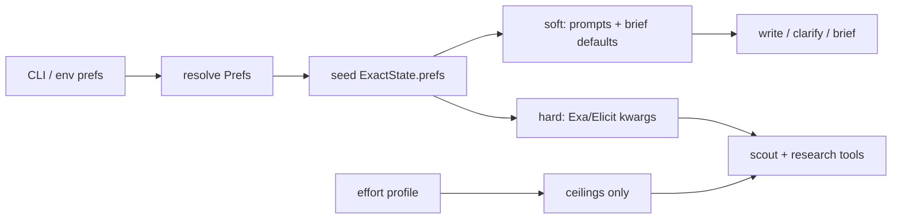

# Plan: User preferences (orthogonal to effort)

**Status:** Design locked — implement by slice (see §8)  
**Spec impact:** Runtime, CLI, prompts; hard Exa filters also change tools — update `docs/spec.md` and `docs/architecture.md` in the same change  
**Out of scope:** Raising spend ceilings; model swaps; free-form system prompts; composite `--profile` presets; JSON/TOML pref files; HTTP API / web UI; Firecrawl / PDF / paywall; new retrieval vendors

**Related:** `effort-levels.md` (removed; `git show 3fae7b8:docs/plans/effort-levels.md`) owned depth and spend. This plan owns taste and retrieval shape under those ceilings.

---

## 1. Goal

Give the user run-level preferences for output taste, source mix, and search bias. Keep them separate from `--effort`.

| Axis | Controls | Must not control |
| :--- | :--- | :--- |
| `effort` | Waves, topics, tool rounds, hits, reasoning / thinking | Tone, language, domains, recency, report shape |
| `prefs` | Output taste; source mix; soft / hard retrieval filters | Raising ceilings; swapping models; new vendors |

If a knob changes spend ceilings, put it in effort. If it only reshapes prompts or Exa / Elicit filters under the same ceilings, put it in prefs.

---

## 2. Latent hooks (reuse, do not duplicate)

- [`ResearchBrief.audience`](../../src/exact/models.py) / `exclusions` / `intent` / `success_criteria` — present, barely prompted, unused by tools
- `brief.intent` already gates Elicit (`web` | `academic` | `mixed`)
- Clarify already names axes: audience, time range, entity, web vs academic ([`prompts.DECIDE_CLARIFY`](../../src/exact/prompts.py))
- Effort plan owns all depth / spend knobs

**Rule:** run-level prefs **seed** brief defaults and tool filters. Clarify may refine unset axes only. Brief remains the north star for the graph.

---

## 3. Locked taxonomy

### 3.1 Output prefs (soft only — writer + optional clarify language)

| Pref | Values (v1 enums) | Inject |
| :--- | :--- | :--- |
| `language` | BCP-47-ish short codes + `auto` (match query) | `WRITE` (+ clarify questions if set) |
| `tone` | `neutral` \| `academic` \| `executive` \| `plain` | `WRITE`; may set brief `audience` default |
| `length` | `short` \| `standard` \| `long` | `WRITE` only (section budget, not more research) |
| `structure` | `report` \| `memo` \| `bullets` | `WRITE` outline instructions |

Rules:

1. Citations still required. Length must not become “skip citations.”
2. Output language is not source language. Translating claims is allowed. Inventing uncited content is not.
3. No free-form user system-prompt string (injection surface). Enums plus a short optional `--audience` text only.

### 3.2 Source prefs (soft + hard)

| Pref | Values | Inject |
| :--- | :--- | :--- |
| `source_mix` | `auto` \| `web` \| `academic` \| `mixed` | Seeds `brief.intent`; `auto` = today’s heuristic |
| `include_domains` | list of hosts | Exa `include_domains` on **general** `exa_search` + scout |
| `exclude_domains` | list of hosts | Exa `exclude_domains` same path |
| `denylist_preset` | `none` \| `social` \| `seo` | Expands to a fixed exclude list in code |
| `recency` | `any` \| `year` \| `month` \| `week` | Exa `start_published_date` on general search + scout |

Rules:

1. People / company tools stay **unfiltered** (matches current spec). Only general Exa search + scout get domain / date filters unless a later spec opens that.
2. Empty results after hard filters → honest `gaps` / `uncovered`, not invented filler.
3. Domain lists are hosts only. Cap list length (≤20) at settings load.
4. Spec + architecture must change in the same PR that adds Exa filters.

### 3.3 Search prefs (bias under fixed ceilings)

| Pref | Values | Inject |
| :--- | :--- | :--- |
| `prefer_primary` | bool | Research + plan prompt: prefer official / primary docs over secondary roundups |
| `news_bias` | bool | Plan prompt toward news-shaped queries; pair with `recency` when set |
| `clarify_mode` | `auto` \| `skip` \| `prefer` | Extends today’s `--skip-clarify`; `prefer` biases decide toward ask when scout is rich |

Not search prefs (belong elsewhere or nowhere):

- More hits / rounds / waves → effort
- Model upgrades / temperature as “creativity” → keep temp at 0
- Full-page / PDF / paywall text → out of scope
- New retrieval vendors → out of scope

### 3.4 Explicitly out of prefs

- Parallel section writers, HTTP API, Studio UI, MCP product, Elicit Reports
- Citation id format / audit (code invariant)
- Snippet / tool-text caps
- Per-role model ids (env already owns those)

---

## 4. Soft vs hard

| Kind | Mechanism | Failure mode |
| :--- | :--- | :--- |
| Soft | Prompt slots + brief field defaults | Model may ignore; still audited for citations |
| Hard | Client kwargs on Exa (and intent gate for Elicit) | Fewer hits; must surface as gaps |

Never pretend a soft pref is enforced. Never hide a hard filter that emptied retrieval.

---

## 5. Surfaces and precedence

**v1 surface:** CLI + env only (same pattern as effort).

Env: `EXACT_LANGUAGE`, `EXACT_TONE`, `EXACT_LENGTH`, `EXACT_STRUCTURE`, `EXACT_SOURCE_MIX`, `EXACT_INCLUDE_DOMAINS`, `EXACT_EXCLUDE_DOMAINS`, `EXACT_DENYLIST`, `EXACT_RECENCY`, `EXACT_PREFER_PRIMARY`, `EXACT_NEWS_BIAS`, `EXACT_CLARIFY_MODE`

CLI: `--lang`, `--tone`, `--length`, `--structure`, `--sources`, `--include-domain` (repeatable), `--exclude-domain`, `--denylist`, `--since`, `--prefer-primary`, `--news`, `--clarify`

**Precedence** (highest wins)

1. CLI flag if passed
2. Matching `EXACT_*` env
3. Defaults: `language=auto`, `tone=neutral`, `length=standard`, `structure=report`, `source_mix=auto`, empty domain lists, `denylist=none`, `recency=any`, bools false, `clarify_mode=auto`

**Clarify:** if a pref already answers an axis (`--sources academic`, `--since year`, `--tone executive` → audience), `decide_clarify` must not re-ask that axis. Free-text clarify may still refine `exclusions` / entities.

**No JSON blob / TOML pref file in v1.** Defer composite `--profile` presets; they hide orthogonality and collide mentally with `--effort`.

---

## 6. State, resume, observability

Mirror the effort-plan resume rule:

1. Seed a frozen `prefs` dump into `ExactState` at run start.
2. On `--thread-id` resume, checkpointed prefs win. Mismatched CLI prefs → **error** (no silent drift).
3. Optional later: one-line prefs summary in status / usage footer. Not required for v1.

---

## 7. Injection map

| Node | Reads |
| :--- | :--- |
| `scout` | `include/exclude_domains`, `denylist`, `recency`; scout Elicit follows `source_mix` (web-only skips Elicit; academic / mixed enables when keyed) |
| `decide_clarify` | Skip axes already set by prefs; `clarify_mode` |
| `generate_brief` | Seed `intent` from `source_mix`; seed `audience` from tone / audience; merge domain excludes into `exclusions` as human-readable notes |
| `plan_topics` | `news_bias`, `prefer_primary` (prompt only) |
| `research_agent` tools | Same hard Exa filters as scout on `exa_search` only; Elicit gate from resolved intent |
| `write_report` | `language`, `tone`, `length`, `structure` slots in `WRITE` |
| `audit_citations` | Unchanged (code) |

---

## 8. Delivery slices

Implement in order. Do not ship hard filters before output prefs.

| Slice | Scope | Spec change? |
| :--- | :--- | :--- |
| 0 | This doc — taxonomy + orthogonality locked | No |
| 1 | Output prefs: `language`, `tone`, `length`, `structure` → Settings + CLI + `WRITE` (+ clarify language) | Presentation prefs note |
| 2 | `source_mix` seeds `brief.intent` + scout Elicit gate | Runtime / brief |
| 3 | Hard Exa filters: domains, denylist, recency on general search + scout | Tools §5 + architecture |
| 4 | `prefer_primary`, `news_bias`, `clarify_mode` | Clarify / plan prompts |

---

## 9. Ideas considered and rejected

| Idea | Why reject |
| :--- | :--- |
| Fold tone into `--effort max` | Confuses spend with taste |
| Free-form `--system` / `--style-prompt` | Prompt injection; untestable |
| Prefs raise `max_hits` for “thorough sources” | That is effort |
| Filter people / company by domain / date in v1 | Spec forbids; weak signal for those categories |
| Named composite profiles in v1 | Collides with effort naming; hides knobs |
| Source-language as hard Exa lang filter | Weak / uneven; prefer output `language` first |
| Temperature / “creativity” | Fights grounded citations |
| Persist global prefs in SQLite outside thread | Later; v1 is per-run CLI / env like effort |

---

## 10. Done when (per implementing PR)

- User can set tone + output language without touching effort.
- `source_mix` can force web-only or academic without raising spend.
- Hard filters (when shipped) are visible in behavior and in empty-gap honesty.
- Resume mismatch on prefs errors like effort mismatch.
- `make check` clean; fakes assert Exa kwargs where filters exist; no live network.
- Spec and architecture updated in the same change as any hard filter or new CLI surface.
